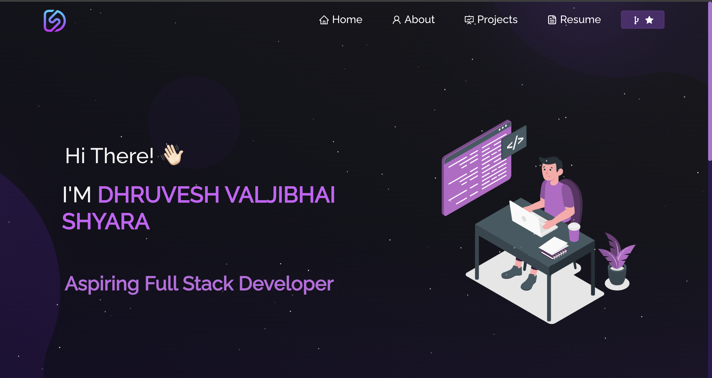

## Portfolio Website  
This is my personal portfolio built with React and Framer Motion.

  

 

 &nbsp;
 &nbsp;
 &nbsp;
 &nbsp;

<h3 align="center">
    🔹
    <a href="https://github.com/Dhruvesh1611/Portfolio/issues">Report Bug</a> &nbsp; &nbsp;
    🔹
    <a href="https://github.com/Dhruvesh1611/Portfolio/issues">Request Feature</a>
</h3>

## TL;DR

You can fork this repo to modify and make changes of your own. Please give proper credit by linking back to [Dhruvesh1611](https://github.com/Dhruvesh1611/Portfolio). Thanks!

## Built With

My personal portfolio [dhruveshshyara.tech](https://dhruveshshyara.tech) (upcoming) which features some of my GitHub projects, my resume, and my technical skills. 

This project was built using these technologies:

- React.js
- Framer Motion
- CSS3
- VS Code
- Vercel

## Features

**📖 Multi-Page Layout**  
**🎨 Styled with CSS with easy-to-customize colors**  
**📱 Fully Responsive**  
**✨ Smooth Animations with Framer Motion**  
**🌑 Dark/Light Mode Toggle**  

## Getting Started

Clone this repository. You will need `node.js` and `git` installed globally on your machine.

## 🛠 Installation and Setup Instructions

1. Installation: `npm install`
2. In the project directory, run: `npm start`

Runs the app in development mode.  
Open [http://localhost:3000](http://localhost:3000) to view it in the browser.  
The page will reload if you make edits.

## Usage Instructions

Open the project folder and navigate to `/src/components/`.  
You will find all the components used, and you can edit your information accordingly.

### Show your support

Give a ⭐ if you like this website!

