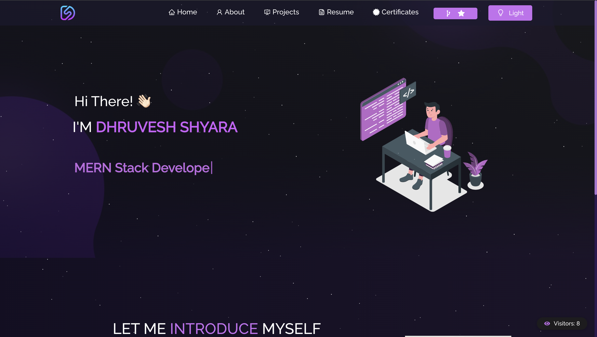
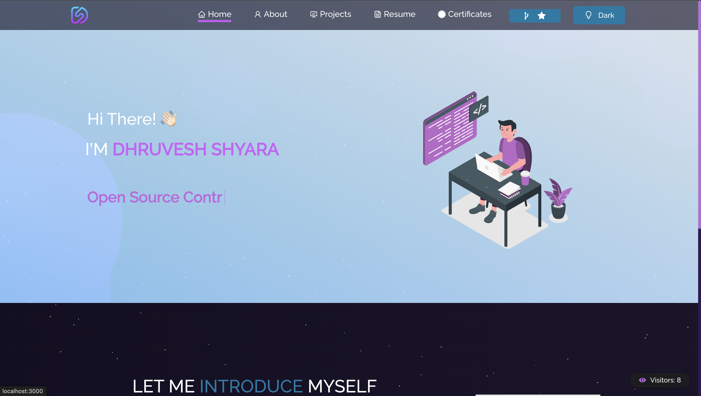
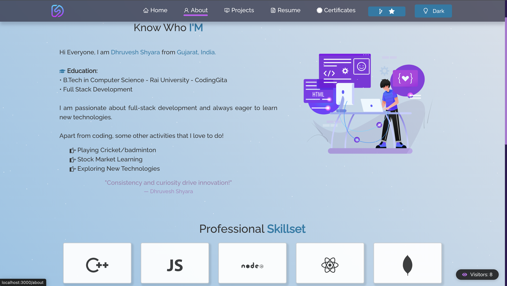
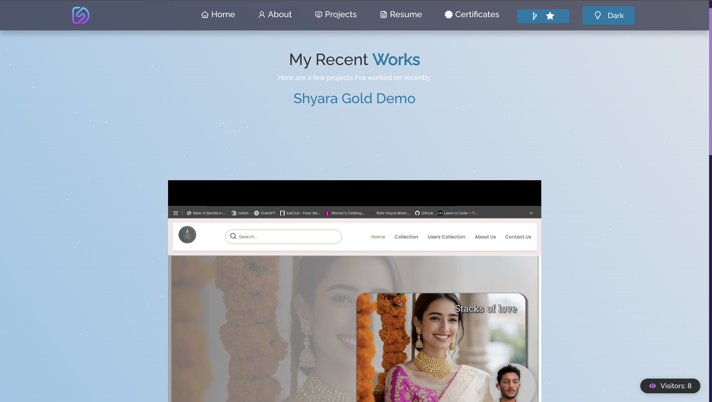
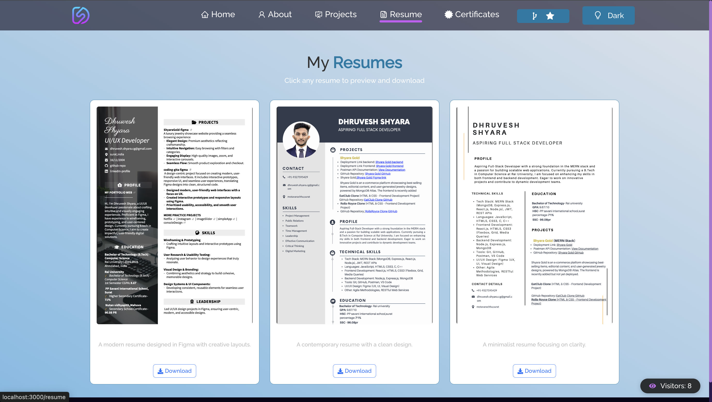
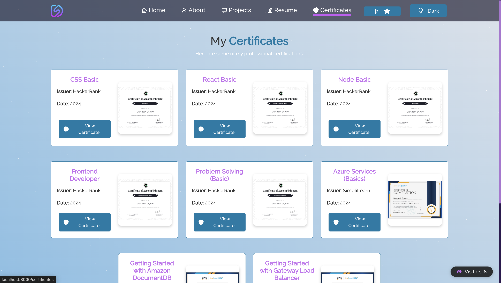

# My Portfolio

This is a personal portfolio website showcasing my projects, skills, and professional journey. It's built to highlight my capabilities as a developer and provide an interactive experience for visitors.


<div align="center">
  
  
</div>

<div align="center">
  
  
  
  
</div>

## ✨ Features

-   **Dynamic Project Showcase:** Explore various projects with filtering options (React, Game, API, etc.).
-   **Certificates Section:** View and access my professional certifications.
-   **Interactive Resume:** Access my resume with full-screen viewing and download options.
-   **Theme Switcher:** Toggle between light and dark themes for a personalized viewing experience.
-   **Visitor Counter:** Track the number of unique visitors to the portfolio.
-   **Responsive Design:** Optimized for various screen sizes, from desktop to mobile.

## 🛠️ Technologies Used

-   **Frontend:**
    -   React.js
    -   HTML5
    -   CSS3 (with custom theming)
-   **Libraries/Frameworks:**
    -   React Router DOM
    -   React Icons
    -   [Other relevant libraries you might be using, e.g., Bootstrap, Material-UI, etc. - Add as needed]

## 🚀 Getting Started

Follow these instructions to get a copy of the project up and running on your local machine.

### Prerequisites

Make sure you have Node.js and npm (or yarn) installed.

-   [Node.js](https://nodejs.org/)
-   [npm](https://www.npmjs.com/get-npm)

### Installation

1.  **Clone the repository:**

    ```bash
    git clone <your-repository-url>
    cd <your-repository-name>
    ```

2.  **Install dependencies:**

    ```bash
    npm install
    # or
    yarn install
    ```

3.  **Run the development server:**

    ```bash
    npm start
    # or
    yarn start
    ```

    This will open the application in your browser at `http://localhost:3000`.

## 💡 Usage

-   Navigate through the sections using the navbar (Home, Projects, Certificates, Resume, About).
-   Use the project filters to explore different categories.
-   Click on project cards, certificates, or resume items for more details or to download.
-   Toggle the theme using the moon/sun icon in the navbar.

## 🤝 Contributing

Contributions, issues, and feature requests are welcome! Feel free to check the [issues page](link-to-your-issues-page-if-any).

## 📄 License

Distributed under the MIT License. See `LICENSE` for more information.

## 📞 Contact

Dhruvesh Shyara - [dhruvesh.shyara.cg@gmail.com](mailto:dhruvesh.shyara.cg@gmail.com)
Portfolio Link: [https://dhruveshshyaraportfolio.netlify.app/](https://dhruveshshyaraportfolio.netlify.app/)
